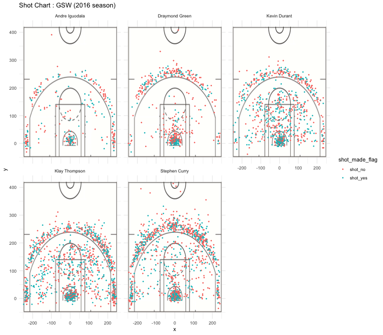

Workout 1
================
Irene Zhang
3/7/2019

### WARRIORS STAT

In the 2016 season, GSW often leads, and warriors significantly has more efficiency than most of other teams, we want to explore the the reason behinds it from opponents' points of view.

By incorporating the statistics and images, we analysis the shooting efficiency and weakness in terms of five outstanding members for this season:

-   Andre Iguodala
-   Draymond Green
-   Kevin Durant
-   Klay Thompson
-   Stephen Curry

First take a look of their standing position of shooting:  Obviously, most of the shots occurs inside the one-point position. And Kevin, Klay, Stephen have more shots than the other two. But each of them has their strength at different positions.

By eyeballing the graph, Stephen Curry seems the one best on both 3 points and 1 point shooting position.

But we don't have the evidence that Stephen Curry is the most efficient player in the team. So it may be a wrong direction if an opponent focus on defend Stephen Curry only.

We have to take the total shots times and the number of shots into consideration. Also, different players are good at shooting in some specific positions.

The following table lists the total shots and the successful shots made by different players:

``` r
# effective shooting % by player
GSW %>% 
  group_by(name) %>% 
  summarise(total = length(name), made = length(shot_made_flag[shot_made_flag == "shot_yes"]) , perc_made = made/total) %>%
  arrange(desc(perc_made))
```

    ## # A tibble: 5 x 4
    ##   name           total  made perc_made
    ##   <fct>          <int> <int>     <dbl>
    ## 1 Kevin Durant     915   495     0.541
    ## 2 Andre Iguodala   371   192     0.518
    ## 3 Klay Thompson   1220   575     0.471
    ## 4 Stephen Curry   1250   584     0.467
    ## 5 Draymond Green   578   245     0.424

Different from eyeballing, almost all the players have nearly 50% chance to make a shot. Among five of these players, Kevin is the most efficient player in different positions. He has 54% chance to make a shot.

And in all the shot attempts in different point field, Draymond Green is the least efficient players among all five players. So if an opponent tried to beat Warriors, can less pay attention to Green's shots.

The following is the table lists in the two-point field, the total shots and the successful shots made by players:

``` r
# 2pt effective shooting % by player
GSW %>%
  filter(shot_type == "2PT Field Goal") %>%
  group_by(name) %>%
  summarise(total = length(name), made =  length(shot_made_flag[shot_made_flag=="shot_yes"]), 
                          perc_made = made/total) %>%
              arrange(desc(perc_made))
```

    ## # A tibble: 5 x 4
    ##   name           total  made perc_made
    ##   <fct>          <int> <int>     <dbl>
    ## 1 Andre Iguodala   210   134     0.638
    ## 2 Kevin Durant     643   390     0.607
    ## 3 Stephen Curry    563   304     0.540
    ## 4 Klay Thompson    640   329     0.514
    ## 5 Draymond Green   346   171     0.494

Surprisingly, Andre Iguodala is the most efficient player in two-point field, and he has 63.8% chance to made a shot!
Also, Draymond Green is the less efficient player among all five. An opponent team has to pay attention to defend Iguodala's shots since he has the highest chance to make a 2-point shot.

Now, let's take a look of the shots' statistics in three-point field:

``` r
# 3pt effective shooting % by player
GSW %>% 
  filter(shot_type == "3PT Field Goal") %>%
  group_by(name) %>%
  summarise(total = length(name), made = length(shot_made_flag[shot_made_flag == "shot_yes"]),
            perc_made = made/total) %>%
  arrange(desc(perc_made))
```

    ## # A tibble: 5 x 4
    ##   name           total  made perc_made
    ##   <fct>          <int> <int>     <dbl>
    ## 1 Klay Thompson    580   246     0.424
    ## 2 Stephen Curry    687   280     0.408
    ## 3 Kevin Durant     272   105     0.386
    ## 4 Andre Iguodala   161    58     0.360
    ## 5 Draymond Green   232    74     0.319

Because it's a data from three-point field, it's understandable that the chance of successful shots are less than any other field.

Although it's difficult to make a shot, it's a great chance to boost points.

Klay Thompson did a great job on making shots - he has 42.4% chance to make a shot. And Stephen Curry as a second efficient player in three-point field, has 40.8% chance to make a shot. So as an opponent team, players have to pay attention to Thompson and Curry.

**In conclusion**, Warriors as a strong team has their own reason. Because of the variety of players' shooting strength, opponents who want to beat them has to plan to defend these players in their weak field.
